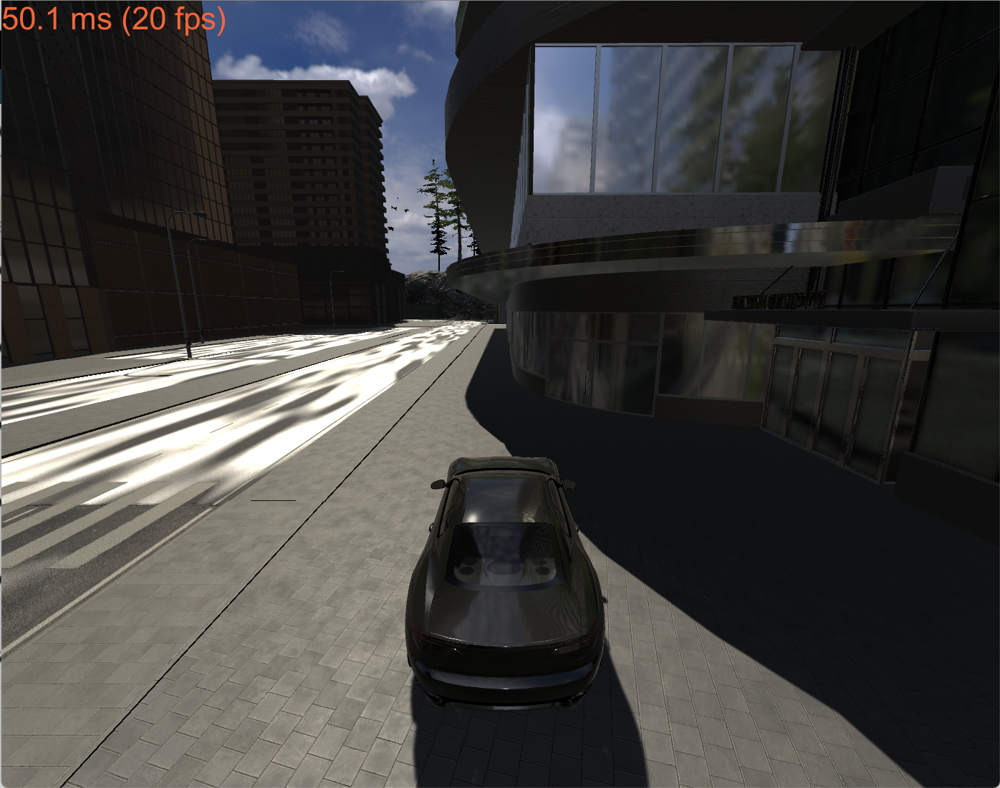
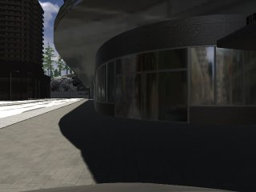
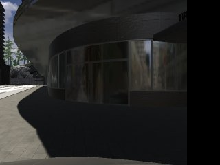
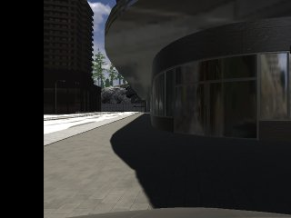

# Imitation Learning in TESSE

This challenge was inspired by the 2019 NEET imitation learning lab (https://github.com/mmaz/imitation_learning_lab, https://markmaz.com/neet/imitation_learning/). We will be using NVIDIA's PilotNet architecture for our CNN to do end-to-end imitation learning on the simple wall following track from Lab 3:


## Workspace setup

For this challenge, use the imitation learning executable [here](https://drive.google.com/drive/u/2/folders/15BGjddbtvlifvTnLO5aHRbJZsQxe2DFP) (all references to "TESSE executable" in this handout refer to this one).

We'd recommend setting up a [new catkin workspace](http://wiki.ros.org/catkin/Tutorials/create_a_workspace) for this challenge. Here let's just call it `learning_ws`.

Follow these instructions to check out the `imitation_learning` branches of `tesse-ros-bridge` and `tesse-interface`. These branches will give you access to a new center RGB camera in addition to the right and left RGB cameras from before.

```
# Clone repo
cd ~/learning_ws/src/
git clone git@github.mit.edu:rss/tesse-ros-bridge.git

# Initialize submodules
cd tesse-ros-bridge/
git submodule init
git submodule update --init --recursive

# Checkout imitation_learning branch
git checkout imitation_learning

# Install tesse python package and checkout imitation_learning branch
cd tesse-interface
git pull
git checkout imitation_learning
pip install -r requirements.txt
python setup.py develop --user  # If using a virtualenv, ommit `--user`

# Some more dependencies; you should already have them
# incl. latest version of opencv-python that supports for 2.7
pip install empy opencv-python==4.2.0.32 PyYAML scipy

# Install dependencies from rosinstall file using wstool
# If this fails, install wstool: sudo apt-get install python-wstool
cd ../..
wstool init
wstool merge tesse-ros-bridge/ROS/install/tesse_ros_bridge.rosinstall
wstool update

# Compile code
cd ../
catkin_make

# Refresh environment
source ~/learning_ws/devel/setup.bash
```

To know if you've done it correctly, first run your executable and launch `tesse_bridge.launch` as per usual. Type `rqt_image_view` into a new terminal. You should be able to see in the upper left dropdown menu topics `/tesse/center_cam/rgb/image_raw`, `/tesse/left_cam/rgb/image_raw`, `/tesse/right_cam/rgb/image_raw`. You should also see that your car in tesse spawns at the simple wall follower track from lab 3. Here's what it should look like:  


Clone your wall follower solution into this new catkin workspace along with this imitation_learning_tesse repo.

**Make sure your wall follower solution on the simple track works with a *constant* Ackermann drive speed command and all the new cameras up and running - use rostopic echo to verify the following topics are all getting published and that the speed of the drive commands is always a constant value:**
- `/tesse/left_cam/rgb/image_raw`
- `/tesse/right_cam/rgb/image_raw`
- `/tesse/center_cam/rgb_image_raw`
- `/tesse/drive`

## Installing dependencies

First, install Python 3.7 for your VM (making may take a while):

```
sudo apt update
cd ~
sudo apt install build-essential zlib1g-dev libncurses5-dev libgdbm-dev libnss3-dev libssl-dev libreadline-dev libffi-dev curl libbz2-dev
curl -O https://www.python.org/ftp/python/3.7.3/Python-3.7.3.tar.xz
tar -xf Python-3.7.3.tar.xz
cd Python-3.7.3
./configure
make
sudo make altinstall
```

At this point, running `python3.7` should work to run Python 3.7 rather than 3.5 (which is all your VM had before). Next, install the remaining dependencies (some of them may take a while, especially OpenCV):

```
sudo pip3.7 install rospkg catkin_pkg
sudo pip3.7 install --upgrade pip
sudo pip3.7 install scikit-build
sudo pip3.7 install opencv-python
sudo pip3.7 install tensorflow==2.4.1
```

## Collecting training data

To train your model, you can use the [staff-provided rosbag](https://drive.google.com/drive/u/2/folders/15BGjddbtvlifvTnLO5aHRbJZsQxe2DFP) (the one called `imitation_learning_wall_follower_simple_3ms_restamp.zip`) of the simple wall follower track from Lab 3. You are welcome (and will probably find it useful) to generate additional rosbags for training data of your own, via the following process:
- Start your TESSE executable (don't forget networking) on your host machine.
- Run `roscore` in a terminal in your VM.
- In a new terminal, navigate to `<catkin workspace>/src/tesse-ros-bridge/ROS/scripts` and run `./rosbag_record.bash` to start recording a rosbag.
- In yet another terminal, start your wall follower launch file from Lab 3.
- Watch your wall follower go for a couple laps around the simple track, then terminate the `rosbag_record.bash` script.
- Next, make sure to restamp the rosbag by running `./restamp_rosbag.py -i <input_rosbag_name.bag> -o <output_rosbag_name.bag>` where `<input_rosbag_name.bag>` is the filename that was specified in the recording script output and `<output_rosbag_name.bag>` must be a different name than the input name.
- You can replay your rosbag by starting `roscore` and running `rosbag play <path to rosbag.bag>`. Make sure when you `rostopic echo` the RGB center camera and drive command topics that they are not empty!

**Again, note that for this lab it is important that you use training data in which the car is moving at a constant speed, as the speed of the car would affect the correct steering angle for a given camera input. If you are using the staff provided rosbag, that one completes the track at a constant speed of 3 m/s. If you wish to train a model for a different speed, you will need to use all your own training data rosbags.**

Given a rosbag (the given staff one in addition to any recorded yourself), you can get extract training data for your model via the provided training node:
- Make a directory at `~/learning_ws/training_data` - this is where the training data images and csv file(s) will be saved.
- In one terminal, launch the training data extraction node via `roslaunch cnn train.launch`.
- In another terminal, start a `roscore`.
- In a third terminal, play back your rosbag(s) while the extraction node is still running.
- When you're done playing back any rosbags you like, you can terminate the extraction node.
- The node will have saved all the center camera images as `.jpg` files as well as a `.csv` file mapping image file paths to steering angles and speeds.
Note that if you run the training data extraction node again, it will keep saving additional `.csv` files in the `training_data` directory rather than adding onto the old one.

## Training your model

Use the provided notebook called `train_pilotnet.ipynb` to train your model. We recommend downloading opening the notebook with Google Colab and mounting your Google Drive account to the notebook (see first cell in notebook) - this way the notebook can read and write data to/from your Google Drive. Upload your `~/learning_ws/training_data` directory to the Drive account you plan to mount.

Take some time to read through the notebook and understand how the training process works - in order to improve the performance of the model you will need to fill in the left and right camera augmentations as well as tune the OFFSET_STEERING_ANGLE parameter. You should also experiment with the hyperparameters of the model (learning rate, dropout, etc) and with additional data augmentations (examples of increased brightness and gamma perturbation augmentations are provided).

The notebook will save augmented images in the `training_data` directory you mount to the Drive, as well as an `augmented_data.csv` file - this way if you want to run the model training cells multiple times without redoing the data augmentation after coming back to Google Colab, you can comment out those cells and run only the cell that reloads the data from `augmented_data.csv`. However, if you change your data augmentation code and rerun it, you should delete `augmented_data.csv` first.

The last cell in the notebook will save your model as a directory with the name you specify in that cell, located in the `training_data` directory in your mounted Drive. You should download this model on your VM for deployment as described in the next section.

### Left and right camera augmentations

In order for your model to be able to recover from any errors in its predictions, it will not be sufficient to simply train it on the center camera view it sees while following the wall using your wall follower algorithm. If your car veers even slightly off this course, it will encounter camera data that it has never seen in training! Therefore, we must augment with fake camera views that simulate what your car would see if it rotated too far to the left or too far to the right.

The NEET lab linked above used a left camera and a right camera placed on either side of the center camera and tilted inwards to generate these augmentations, but we don't have this data in TESSE, so we will fake left and right camera views using image processing in OpenCV.

You will need to use the OpenCV functions getPerspectiveTransform and warpPerspective to implement the `rotate_car_left` and `rotate_car_right` helper functions in the training notebook. You'll have to play with how much to rotate the image (which will also affect the correct choice of the OFFSET_STEERING_ANGLE parameter used to generate fake steering angles corresponding to the left and right camera augmentations). Test out your rotation functions by visualizing the result!

An example center camera view:  


An example fake "left" camera view (or result of `rotate_car_right`):  


An example fake "right" camera view (or result of `rotate_car_left`):  


Notice that there is a black bar of blank spice left over on the sides of the "tilted" images as a result of our preprocessing technique - you might want to make sure that whatever cropping you are using in the `preprocess` helper function of the training notebook is cropping out that black bar, because the car won't see anything like that black bar when testing the deployed model in TESSE!

## Deploying your trained model

Fill in the `model` parameter in `params.yaml` with the absolute path to your saved model (the model directory, not the zip file downloaded from Drive). **Also, make sure the `velocity` parameter is set to the constant speed of your drive commands that you used for training data - otherwise you will be testing your model on a different speed than it was trained on!**

*NOTE: if you changed the input image cropping in the pilotnet definition cell of the training notebook, make sure to copy those changes over to `imitation_learning_tesse/src/pilotnet.py`, or you will get dimension errors during inference.* **This is also essential to making sure the same preprocessing is happening for camera input in testing as in training!**

Then launch the provided inference node to drive your car in TESSE using steering angle predictions from your trained PilotNet model:
- In a terminal on your VM, run `roslaunch cnn infer.launch`.
- Wait for the inference node to print `[INFO] [1619242384.607314]: INITIALIZATION COMPLETE`.
- Start your TESSE executable on your host machine.
- In another terminal on your VM, run `roslaunch tesse_ros_bridge tesse_bridge.launch` and wait for the bridge to print `('TESSE_ROS_NODE: Initialization complete.',)`.
- The inference node should now start printing out predicted steering angles and your car should start moving accordingly in TESSE.

Make sure your inference node is publishing predicted drive commands at a reasonable rate using `rostopic hz` - if you have performance issues with TESSE on your computer, it might be best to have the teammate with the best TESSE performance run tests of the deployed model.

## Tips

- Generating and augmenting data, as well as tuning and training models, takes a long time - start early!
- Have a systematic method for organizing your different data augmentation experiments and model hyperparameter tunings - it will pay off to stay organized as you try to analyze the effects of the changes on your model's performance in deployment!
- Experiment with the model hyperparameters - drop out probability, number of epochs, samples per epoch, batch size, learning rate, model layers, regularization, etc.
- More data is a better model - and more data augmentation is a more robust model. If your model is struggling to capture behavior on certain problem areas of the track, collect more training data for those areas. You can (and should) also play with additional augmentations beyond the examples provided!
- You can play with the crop on the input images, or with shrinking the images instead of cropping to retain more information from outside the cropped region.
- Another avenue for exploration is to make the offsets for the fake left and right camera augmentation asymmetrical rather than using the same image tilt and angle offset for each.
- The OFFSET_STEERING_ANGLE parameter is very important - because we are faking left and right cameras with an arbitrary image processing method, we don't know the true theoretical steering angle offset that corresponds to the camera angles, so the only way to find out is to try many values and carefully tune it.
- Visualize your training data! The provided methods for viewing histograms of your training data are very helpful, as well as the ability to view the RGB camera images themselves.
- You might find it helpful to run the training data extraction node on a rosbag of your *deployed model* to store a record of the camera images your model saw and what steering angles it predicted for those images. We recommend doing this on a rosbag of the deployed model and not running training data extraction in real time while deploying your model because it could have an adverse effect on the performance of the inference node.

As an optional extension to the challenge, you could try to make the model work for variable driving speeds by changing the output layer in the model architecture to have two outputs, one for steering angle and one for speed - note that the training data extraction node already extracts speed for you as well as steering angle in the third column.
